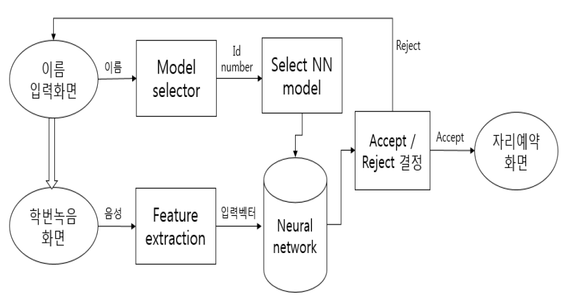
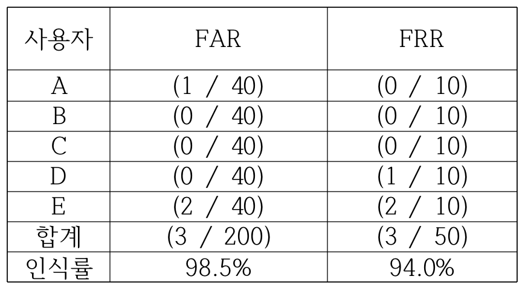

# 화자검증기반 도서관 열람실 자리예약 시스템
* Java, Eclipse-oxygen 1A, Swing toolkit, Matlab, Goldwave

* 뉴럴네트워크는 매트랩의 nprtool에서 역전파알고리즘에 의해 학습된 뉴럴 가중치를 사용합니다.
* Java로 구현한 네트워크는 Feed Foward Network입니다. 여기에 학습된 뉴럴 가중치를 사용하여 학습된 모델을 만들 수 있습니다.

* MFCC 특징 추출 알고리즘과 음성녹음기능은 open source 를 사용하여 프로젝트에 맞게 수정했습니다.

* 시스템 알고리즘
 사용자는 첫 번째 화면에서 자신의 이름을 입력한다. 각 이름별로 일정한 식별 번호가 저장되어 다음 페이지로 넘어간다. 넘어온 식별 번호를 통해 그 사용자의 뉴럴네트워크 모델이 준비된다. 사용자는 두 번째 페이지에서 학번을 발화한다. 녹음된 음성은 바로 mfcc특징을 추출하여 준비된 뉴럴네트워크에 입력데이터로 사용된다. 뉴럴네트워크는 입력된 데이터를 사용해 정확도를 측정한 뒤 정해놓은 임계치를 넘으면 승인 하게된다. 승인된 사용자만이 열람실 자리를 예약할 수 있다.
 
 ### * 사용자 검증 알고리즘 블록 다이어그램
</img> 

### * 애플리케이션 화면
### 이름입력화면, 학번녹음 화면, 자리예약 화면
</img> 

### * 성능 확인 FAR/FRR
</img> 

